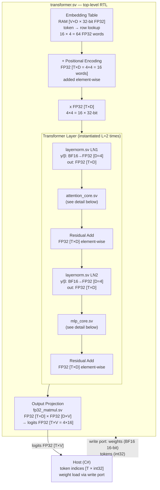
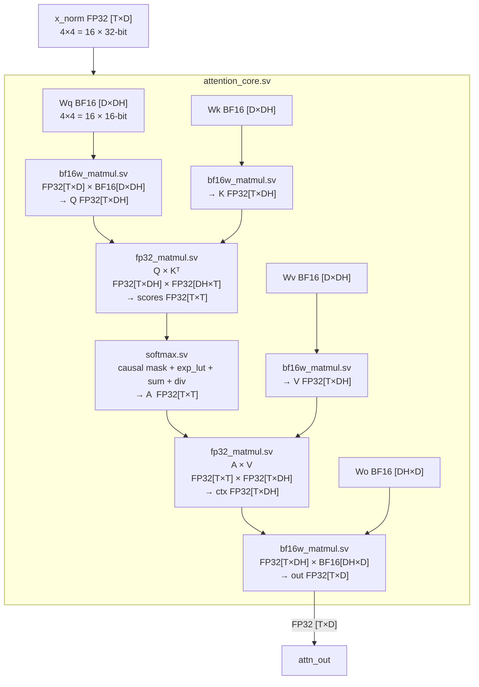
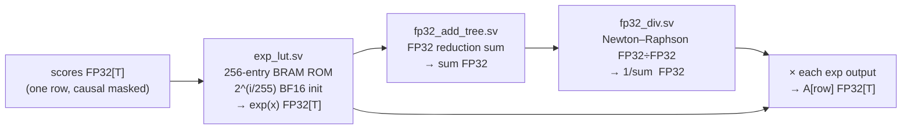
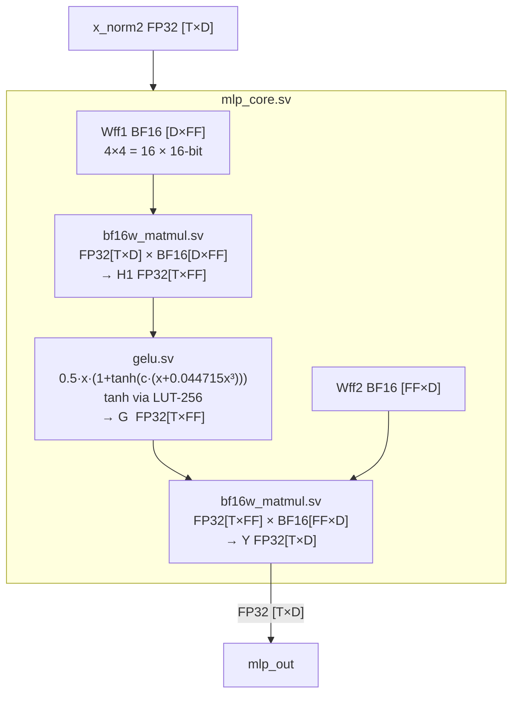
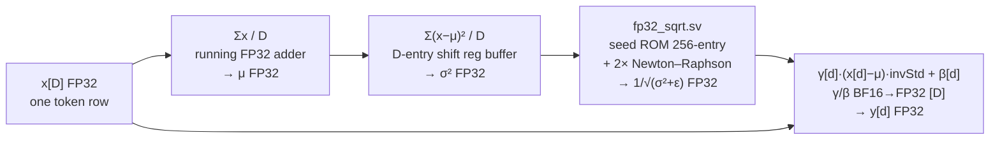
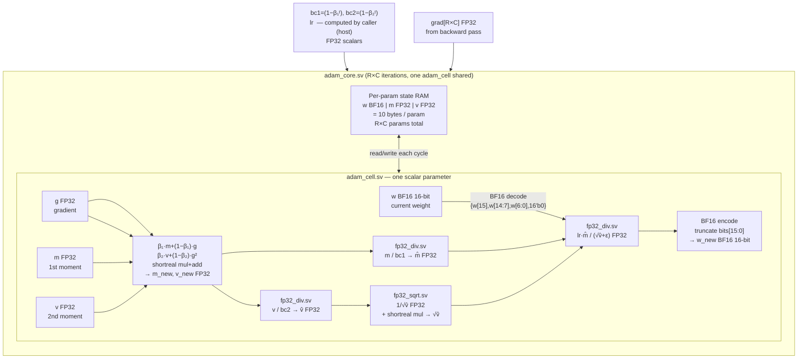

# NeuronFabric FPGA — High-Level Block Diagram

> Phase 1 (XSim verification) configuration: T=4, D=4, heads=1, FF=4, L=2, V=16.
> Weights are BF16 (16-bit); all activations and Adam state are FP32 (32-bit).
> No ARM/PS core used — pure PL (programmable logic), driven by host C# over JTAG/PCIe in production.

## Top-Level Datapath

## attention_core.sv — Internal Datapath

## softmax.sv — Internal Datapath

## mlp_core.sv — Internal Datapath

## layernorm.sv — Internal Datapath

## adam_core.sv / adam_cell.sv — Update Datapath

## Bit-Width Summary

| Signal class | Width | Format | Notes |
|---|---|---|---|
| Activations (x, Q, K, V, A, H1, G, logits) | 32-bit | IEEE 754 FP32 | All intermediate activations |
| Weights (Wq/Wk/Wv/Wo/Wff1/Wff2/LN γ/β) | 16-bit | BF16 | Stored/updated as BF16; decoded to FP32 on read |
| Adam 1st moment m | 32-bit | FP32 | Full precision maintained between steps |
| Adam 2nd moment v | 32-bit | FP32 | Full precision maintained between steps |
| Token indices | 32-bit | int | Host → Embedding lookup |
| Embedding table entries | 32-bit | FP32 | Weight-tied with output projection |
| exp LUT entries | 16-bit | BF16 | 256-entry BRAM ROM, `2^(i/255)` |
| fp32_sqrt seed ROM | 32-bit | FP32 | 256-entry, indexed by mantissa top 8 bits |

## ARM / PS Role

The **training datapath runs entirely in PL (programmable logic)**. The Zynq PS (ARM)
is used only for orchestration: loading test vectors, triggering training steps,
reading results, and experiment control. It does not participate in any arithmetic —
no matrix multiply, no Adam update, no activation computation runs on ARM.

In XSim simulation the host role is played by C# directly via file I/O (hex vectors);
on hardware the PS takes that role over AXI or JTAG.
